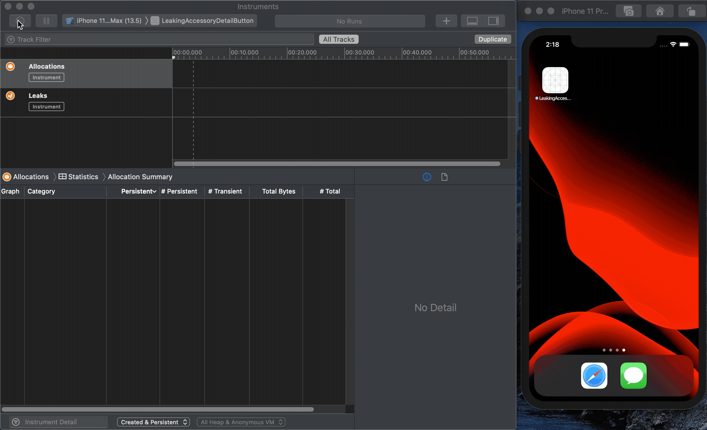

# Leaking Accessory Detail Button

This project is demonstrating a memory leak in iOS 13.5 with Accessory Detail Buttons on Custom Table View Cells.

## Version Numbers

XCode Version 11.5 (11E608c)

Simulator Version 11.5 (921.9.1)

SimulatorKit 581.9.1

CoreSimulator 704.12.2

iOS Version 13.5

## How the project was built

1. Create Single View App XCode iOS Project
2. Embed existing View Controller inside a Navigation Controller
3. Add a TableViewController and a Segue from ViewController to TableViewController
4. Subclass UITableViewController and UITableViewCell
5. Set classes in Interface Builder
6. Set Reuse Identifier
7. Set Cell Accessory to Detail in Interface Builder
8. Add dummy data
9. Configure cell

